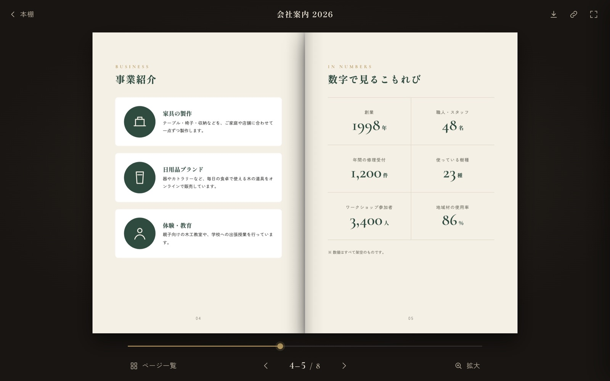
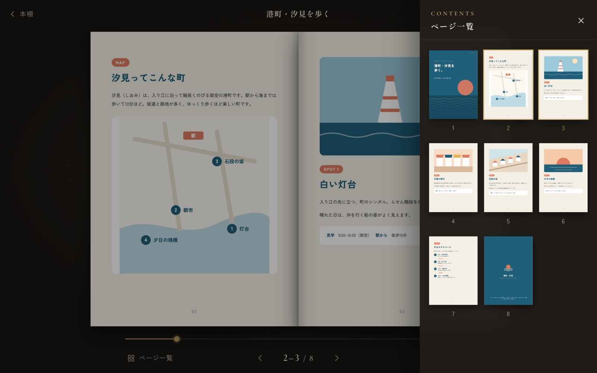
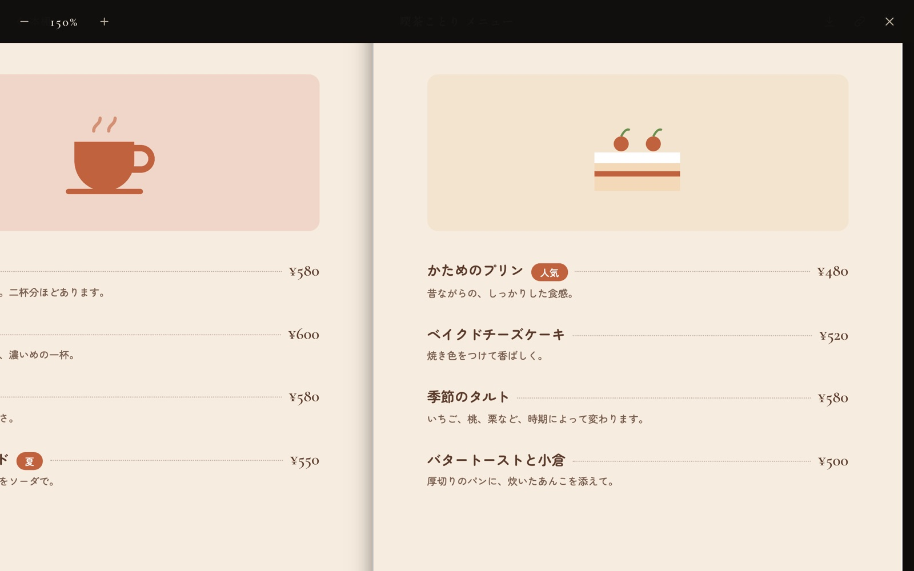
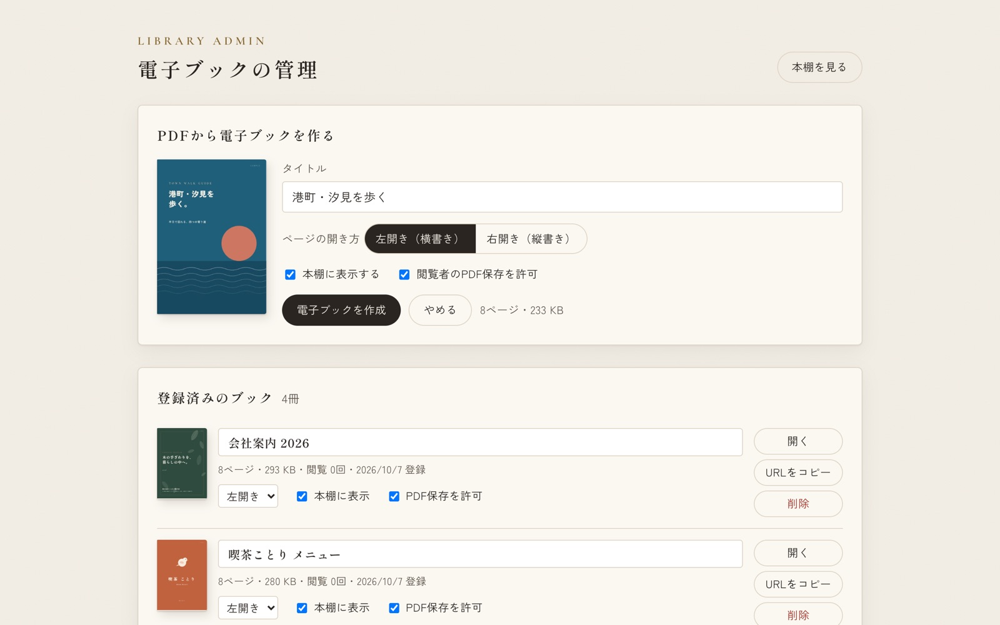
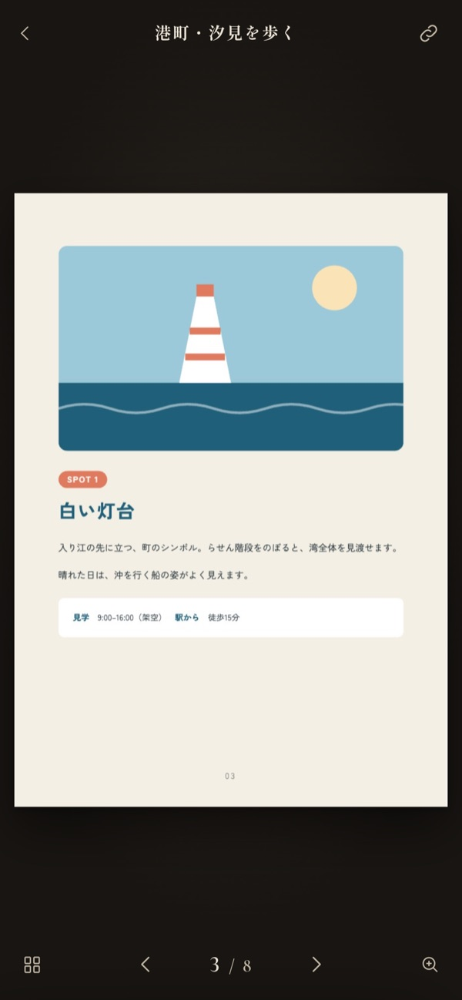

# 電子ブック本棚（Google Apps Script）

PDFをアップロードするだけで、ページをめくって読める電子ブックになり、URLで共有できるWebアプリです。
Google Apps Script（GAS）で動くので、Googleアカウントがあれば無料で使えます。サーバーの用意はいりません。

**デモ**：準備中

## 特長

- **PDFをそのまま電子ブックに**：管理画面にPDFをドラッグするだけ。1ページ目から表紙を自動で作ります
- **本のようにめくれる**：クリック・スワイプ・←→キーでページめくり。PCは見開き、スマホは1ページ表示に自動で切り替え
- **右開き（縦書き）に対応**：見開きの左右も紙の本と同じ並びになります
- **ページ一覧・拡大表示**：サムネイルから目的のページへ移動。細かい文字は最大300%で拡大
- **URLで共有**：見る人はインストールもログインも不要。`&p=5` を付けると5ページ目から開きます
- **本棚の演出**：表紙を押すと本が棚から取り出され、表紙がめくれて開きます
- **日本語PDFに対応**：フォントが埋め込まれていない日本語PDFも正しく表示します

| 見開き表示 | 右開き（縦書き） |
|---|---|
|  |  |
| **ページ一覧** | **拡大表示** |
|  |  |
| **管理画面** | **ページめくり** |
|  |  |

  
  

## 画面とURL

| 画面 | URL | 使う人 |
|---|---|---|
| 本棚 | `（デプロイURL）` | 閲覧者。「本棚に表示」がONのブックが並ぶ |
| 閲覧 | `（デプロイURL）?book=ブックID` | 閲覧者。`&p=5` で5ページ目から開く |
| 管理画面 | `（デプロイURL）?page=admin&key=管理キー` | 管理者だけ。PDFの登録・編集・削除 |

## 設置手順

### 1. プロジェクトを作ってファイルを貼り付ける

1. https://script.google.com で「新しいプロジェクト」を作る
2. `src/` の中のファイルを、同じ名前で作って中身を貼り付ける

| ファイル | GASエディタでの作り方 |
|---|---|
| `Code.gs` | 最初からある「コード.gs」に貼り付けてOK（名前はそのままで動きます） |
| `Admin.html` など6つ | 「＋ → HTML」で作成。名前は **`.html` を付けずに** `Admin` と入力 |
| `appsscript.json` | 「プロジェクトの設定 → 『appsscript.json』マニフェスト ファイルをエディタで表示する」をONにすると出てくる |

> **よくあるつまずき**：HTMLの名前に `Admin.html` と入力すると、実際の名前は `Admin.html.html` になり、「HTMLファイルが見つかりません」というエラーになります。

HTMLファイルは `Admin` `Common` `NotFound` `Shelf` `Styles` `Viewer` の6つです。

### 2. 初期設定

エディタで関数 `setup` を選んで実行し、権限（Googleドライブとスプレッドシート）を許可します。
マイドライブに「電子ブック」フォルダができ、PDFと管理シート「電子ブック管理」がそこに保存されます。

### 3. ウェブアプリとして公開

「デプロイ → 新しいデプロイ → 種類：ウェブアプリ」

- 次のユーザーとして実行：**自分**
- アクセスできるユーザー：**全員**（組織内だけに見せる場合は「（組織名）内の全員」）

### 4. 管理画面のURLを確認

もう一度 `setup` を実行すると、実行ログに **管理画面URL** が出ます。ブックマークしておいてください。

### コードを更新したとき

「デプロイを管理 → 編集（鉛筆アイコン）→ バージョン：新バージョン → デプロイ」で反映されます。URLは変わりません。

## 使い方

1. 管理画面にPDFをドラッグ（またはクリックして選択）
2. タイトル・開き方（左開き／右開き）・本棚に表示するか・PDF保存を許可するかを選ぶ
3. 「電子ブックを作成」を押すと本棚に並ぶ

登録したあとも、管理画面でタイトルや設定を変更できます。閲覧回数も記録されます。

## 設定

| 場所 | 項目 | 初期値 |
|---|---|---|
| `Code.gs` | `APP_TITLE`（本棚のタイトル） | 電子ブック本棚 |
| `Code.gs` | `MAX_UPLOAD_MB`（1ファイルの上限） | 30 |
| `Shelf.html` | `NEW_DAYS`（「NEW」を付ける日数） | 14 |

## 注意

- **閲覧URLを知っている人はだれでも見られます。**「本棚に表示」をOFFにしても、URLを知っている人は見られます。社外秘の資料は、公開範囲を組織内に絞ってください。
- **管理画面のURLは他人に教えないでください。** 漏れたときは、エディタで `resetAdminKey` を実行すると古いURLが無効になり、新しいURLがログに出ます。
- 1ファイル **30MBまで**です（`google.script.run` で一度に送れる量の目安）。大きいPDFは圧縮してから登録してください。
- 閲覧時はPDF全体を読み込んでから表示するため、大きいPDFほど最初の表示に時間がかかります。
- 削除するとPDFはドライブのゴミ箱に移ります。

## 仕組み

| 役割 | 使っているもの |
|---|---|
| 画面・サーバー処理 | Google Apps Script（ウェブアプリ） |
| PDFの保存 | Googleドライブ |
| ブックの一覧・設定・閲覧数 | Googleスプレッドシート |
| PDFの描画 | pdf.js |
| ページめくり | StPageFlip |

| ファイル | 役割 |
|---|---|
| `Code.gs` | 画面の振り分け、保存、管理者チェック |
| `Shelf.html` / `Viewer.html` / `Admin.html` / `NotFound.html` | 本棚・閲覧・管理・エラーの各画面 |
| `Styles.html` / `Common.html` | 共通の見た目・共通処理（pdf.js の読み込みなど） |

改修する人向けのメモ：

- 右開きは StPageFlip が対応していないため、ページの並びを逆にして最後から開いています（奇数ページのときは白紙を1枚足して見開きをそろえる）。
- ページは canvas ではなく画像（JPEG）で表示しています。StPageFlip は1ページ表示でめくるとき要素を複製するため、canvas だとめくり中が白紙になります。
- GASの画面は別オリジンのiframeで動くため、pdf.js のワーカーは Blob URL にして起動しています。
- 閲覧時のPDFは4MBずつ並列に取得します。ブックIDからしか引けないので、ドライブのほかのファイルは読めません。
- `google.script.run` からは末尾が `_` でない関数をだれでも呼べます。管理用の関数を足すときは必ず `assertAdmin_(key)` を通してください。

## サンプルPDF

`samples/` に動作確認用の見本PDFを4冊入れています。内容・会社名・人物・住所などはすべて架空です。自由に使ってください。

| ファイル | 内容 |
|---|---|
| `01_company-profile.pdf` | 会社案内（架空の木工会社） |
| `02_cafe-menu.pdf` | 喫茶店のメニューブック |
| `03_vertical-rtl.pdf` | 季節のことば（縦書き・右開きの確認用） |
| `04_town-guide.pdf` | 港町の散歩ガイド |

`03_vertical-rtl.pdf` は、登録するときに「右開き（縦書き）」を選んでください。

## 使用しているライブラリ・フォント

いずれもCDN・Google Fontsから読み込んでいます（このリポジトリには含まれていません）。

- [pdf.js](https://github.com/mozilla/pdf.js) 3.11.174 — Apache License 2.0
- [StPageFlip（page-flip）](https://github.com/Nodlik/StPageFlip) 2.0.7 — MIT License
- [Google Fonts](https://fonts.google.com/)：Shippori Mincho、Zen Kaku Gothic New、Cormorant Garamond（サンプルPDFでは Zen Maru Gothic、Zen Old Mincho も使用）— SIL Open Font License 1.1

## ライセンス

[MIT License](LICENSE)
